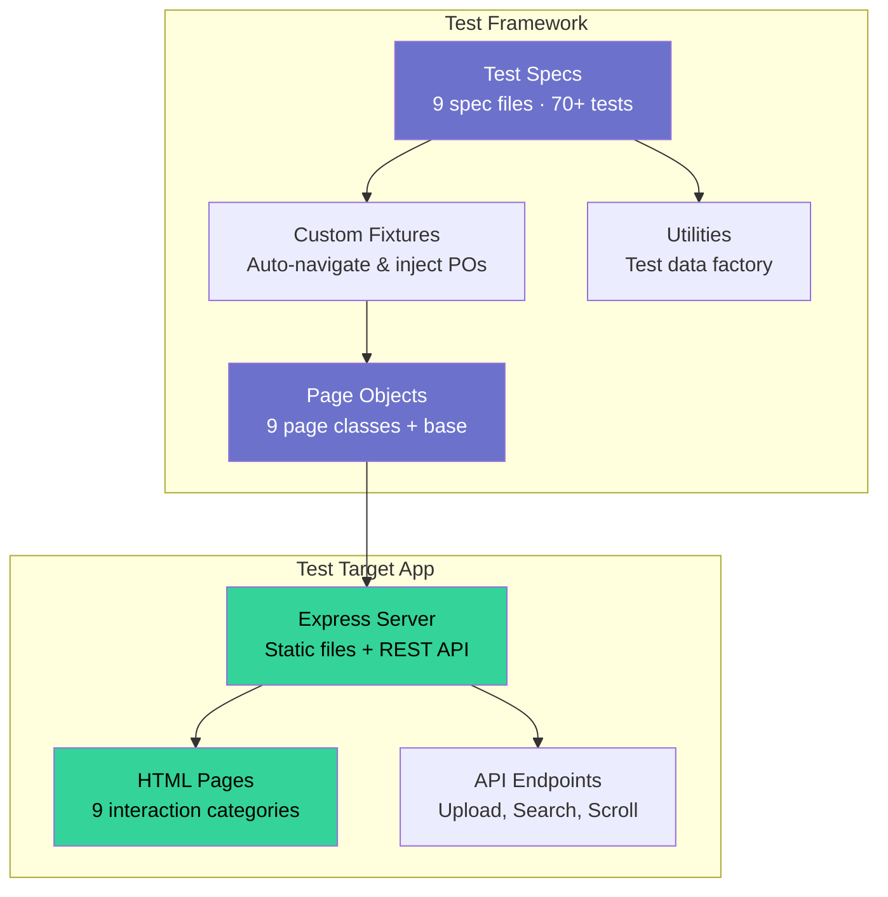

# Playwright UI Interactions

[](https://github.com/<your-username>/playwright-ui-interactions/actions)


**Comprehensive demonstration of automating every UI interaction pattern with Playwright + TypeScript.** This project ships a purpose-built Express web app containing every category of interactive UI element, paired with production-grade Playwright tests that demonstrate the idiomatic way to automate each one.

---

## Architecture



---

## What This Demonstrates

| Category | Interactions Covered | Key Playwright APIs |
|---|---|---|
| **Basic Clicks** | Single, double, right-click, modifier keys, counters, enable/disable, show/hide | `click()`, `dblclick()`, `click({button})`, `click({modifiers})`, `toBeDisabled()`, `toBeVisible()` |
| **Text Input** | Fill, type char-by-char, clear, focus/blur, textarea, number, contenteditable, validation | `fill()`, `pressSequentially()`, `clear()`, `focus()`, `blur()`, `toHaveValue()` |
| **Form Controls** | Checkbox, radio, select, multi-select, date, range slider, toggle switch, form submit | `check()`, `uncheck()`, `selectOption()`, `toBeChecked()` |
| **Keyboard & Mouse** | Hotkeys, key combos, key events, hover, tooltip, hover menu, drag & drop, tab navigation | `keyboard.press()`, `hover()`, `dragTo()` |
| **Browser Dialogs** | Alert, confirm, prompt, chained dialogs, beforeunload | `page.on('dialog')`, `dialog.accept()`, `dialog.dismiss()` |
| **Frames & Windows** | Iframe interaction, nested iframes, new tabs, popups, cross-frame messaging | `frameLocator()`, `waitForEvent('page')` |
| **Dynamic Content** | Autocomplete, debounced input, delayed render, notifications, toast, infinite scroll, lazy load | `toBeVisible({timeout})`, `scrollIntoViewIfNeeded()`, `evaluate()` |
| **File Operations** | Single upload, multi upload, server upload, download link, download via JS | `setInputFiles()`, `waitForEvent('download')` |
| **Clipboard** | Copy button, paste button, Ctrl+C/Ctrl+V, clipboard API | `keyboard.press('ControlOrMeta+c')`, `navigator.clipboard`, `permissions` |

---

## Quick Start

```bash
# Clone
git clone https://github.com/<your-username>/playwright-ui-interactions.git
cd playwright-ui-interactions

# Install
npm install
npx playwright install --with-deps chromium

# Run all tests
npm test

# Run headed (watch tests execute in browser)
npm run test:headed

# Interactive UI mode
npm run test:ui

# Debug mode (step through tests)
npm run test:debug
```

**Zero-friction guarantee:** `npm test` auto-starts the Express app via Playwright's `webServer` config — no manual server startup needed.

---

## Project Structure

```
playwright-ui-interactions/
├── apps/web/                         # Self-built test target application
│   ├── public/
│   │   ├── css/styles.css            # Shared dark-themed stylesheet
│   │   ├── pages/                    # One HTML page per interaction category
│   │   │   ├── basic-clicks.html
│   │   │   ├── text-input.html
│   │   │   ├── form-controls.html
│   │   │   ├── keyboard-mouse.html
│   │   │   ├── dialogs.html
│   │   │   ├── frames-windows.html   # + iframe-content.html, popup.html
│   │   │   ├── dynamic-content.html
│   │   │   ├── file-operations.html
│   │   │   └── clipboard.html
│   │   └── index.html                # Home — card grid linking all pages
│   └── src/server.js                 # Express server with REST endpoints
├── src/
│   ├── tests/                        # One spec per interaction category
│   ├── pages/                        # Page objects (1 per page + base)
│   ├── fixtures/page.fixtures.ts     # Custom fixtures: auto-navigate + inject POs
│   ├── utils/test-data.helper.ts     # Test file factory for upload tests
│   └── types/app.types.ts            # Shared TypeScript interfaces
├── .github/workflows/ci.yml          # GitHub Actions pipeline
├── playwright.config.ts              # Playwright config with webServer
├── tsconfig.json                     # Strict TypeScript
├── package.json
└── README.md
```

---

## Design Decisions

### Self-built test app vs. public test sites
External sites can change, go down, or rate-limit CI. A self-built app means deterministic tests, exactly the complexity needed, and demonstrates system-level understanding.

### Custom fixtures instead of `test.beforeEach`
Playwright fixtures provide automatic page object injection, navigation handled once per fixture, full TypeScript type safety, and lazy initialization (only used fixtures are created).

### `data-testid` selectors
Decoupled from styling and structure, explicit contract between developers and testers, and the best practice endorsed by Playwright docs.

### `pressSequentially` vs `fill` for character-by-character input
`fill()` sets the value instantly. `pressSequentially()` fires individual key events — essential for testing keystroke-dependent features like autocomplete and debounce.

### `ControlOrMeta` for clipboard tests
Maps to Ctrl on Windows/Linux and Cmd on macOS — cross-platform without conditional logic.

---

## Key Patterns to Notice

1. **Page Object encapsulation** — tests never touch raw selectors
2. **Fixture-based DI** — page objects injected via Playwright's fixture system
3. **Test data factory** — file upload tests create temp files, cleaned up in `afterAll`
4. **Dialog handling** — `page.on('dialog')` registered before the triggering action
5. **Frame traversal** — `frameLocator()` chain for nested iframes
6. **Multi-page coordination** — `waitForEvent('page')` + `Promise.all` for new tabs/popups
7. **No `waitForTimeout`** — all waits use auto-retrying assertions

---

## CI/CD

The GitHub Actions workflow:
1. Checks out the repo on ubuntu-latest
2. Installs Node 20 with npm cache
3. Installs Playwright's Chromium browser
4. Runs all tests (Express app starts automatically via `webServer`)
5. Uploads HTML report as artifact on any outcome

---

## Extending This Project

**Add a new interaction category:**
1. Create HTML page in `apps/web/public/pages/`
2. Create page object in `src/pages/`
3. Register in `src/fixtures/page.fixtures.ts`
4. Write tests in `src/tests/`
5. Add card to homepage `index.html`

**Add more browsers:** Edit `playwright.config.ts` projects array.

**Add API endpoints:** Add routes to `apps/web/src/server.js`.

---

## License

MIT
